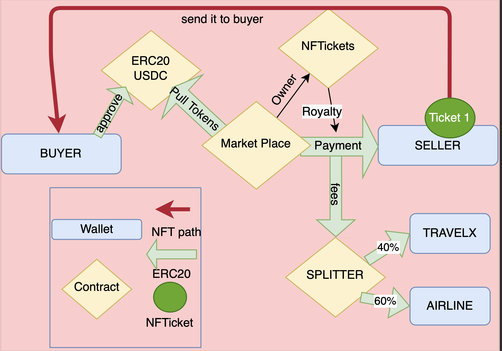

<h1 align="center">TRAVEL X MARKETPLACE </h1>

    
  

## Situation

- TravelX needed a marketplace to buy and sell NFTickets and to do it entirelly on the blockchain, in a decentralized way. So we created a marketplace that takes USDC (in this case is a fake ERC-20 token we created for the occasion) and in the same transaction then recieves the tokens it transfers the NFTicket to the buyer. 5% of each sale goes as a royalty to an Open Zeppelin splitter contract that divides fees for TravelX and the Airline

## Arquitecture

## Technology Stack & Tools

- Solidity (Writing Smart Contracts & Tests)
- Javascript (Scripts & Testing)
- [Hardhat](https://hardhat.org/) (Development Framework)
- [Ethers.js](https://docs.ethers.io/v5/) (Blockchain Interaction)

## Requirements For Initial Setup

- Install [NodeJS](https://nodejs.org/en/)

## Setting Up

### 1. Clone/Download the Repository

### 2. Install Dependencies:

`$ npm install`

### 3. Run tests

`$ npm test`

### 4. Start Hardhat node

`$ npm start`

### 5. Run deployment script

In a separate terminal execute:
`$ npm run program`

## Important stuff>

- TravelX works with Algorand blockchian, this work was made as a challenge with the tools we have and works great on EVM blockchains. It's important to know that this job needs to be adapted to work on AVM.

- During the interaction with scripts, NFT creation is limited to 3 because of the IPFS metadata. To create more tickets the IPFS database should be amplified
